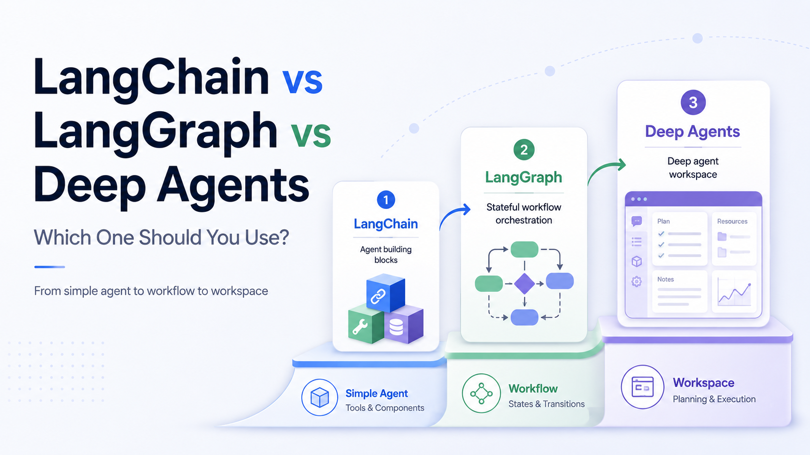



# Agent Frameworks Field Guide

Companion code for a practical article series on **LangChain vs LangGraph vs Deep Agents**.

The series uses one shared example: an **AI Content Strategy Assistant**. Given a topic, the assistant helps identify the audience, suggest article angles, create an outline, call out risks, and recommend next steps.

## Article Series

This repository accompanies the article series published on Medium.

Published so far:

- [LangChain vs LangGraph vs Deep Agents: Which One Should You Use?](https://medium.com/@shubhambrth/langchain-vs-langgraph-vs-deep-agents-which-one-should-you-use-978e36c7f495)
- [Building an AI Content Strategy Assistant with LangChain](https://medium.com/@shubhambrth/building-an-ai-content-strategy-assistant-with-langchain-569659066747)
- [Building an AI Content Strategy Assistant with LangGraph](https://medium.com/@shubhambrth/building-an-ai-content-strategy-assistant-with-langgraph-606c3b68802c)

## Current Status

The repo currently includes two runnable implementations:

- `examples/01_langchain`: AI Content Strategy Assistant built with LangChain
- `examples/02_langgraph`: the same assistant rebuilt as an explicit LangGraph workflow

Coming later:

- `examples/03_deepagents`: the same assistant framed as a deeper Deep Agents work session

## What Is Included Now

```text
agent-frameworks-field-guide/
|-- .env.example
|-- README.md
|-- pyproject.toml
|-- uv.lock
|-- images/
|   `-- cover_art.png
|-- src/
|   `-- agent_frameworks_field_guide/
|       |-- config.py
|       |-- sample_data.py
|       |-- schemas.py
|       `-- tools.py
`-- examples/
    |-- 01_langchain/
    |   |-- agent.py
    |   `-- README.md
    `-- 02_langgraph/
        |-- graph.py
        `-- README.md
```

## Why OpenRouter?

This project uses OpenRouter as the default model provider.

Two useful reasons:

1. You can access many models under one API.
2. Some free models may be available for exploration.

Model availability can change, so check OpenRouter before running the examples.

## Setup

Install dependencies with `uv`:

```bash
uv sync
```

Create a `.env` file from `.env.example`:

```bash
OPENROUTER_API_KEY=your-key-here
OPENROUTER_MODEL=~openai/gpt-latest
OPENROUTER_BASE_URL=https://openrouter.ai/api/v1
```

The real `.env` file should stay local and must not be committed.

## Run the Examples

Run the LangChain example:

```bash
uv run python examples/01_langchain/agent.py
```

Run the LangGraph example:

```bash
uv run python examples/02_langgraph/graph.py
```

Both examples use the same core prompt:

```text
Create a content strategy for a blog series about LangChain, LangGraph, and Deep Agents.
```

## Connect

- LinkedIn: [Shubham Barthwal](https://www.linkedin.com/in/shubham-barthwal/)
- Medium: [@shubhambrth](https://medium.com/@shubhambrth)